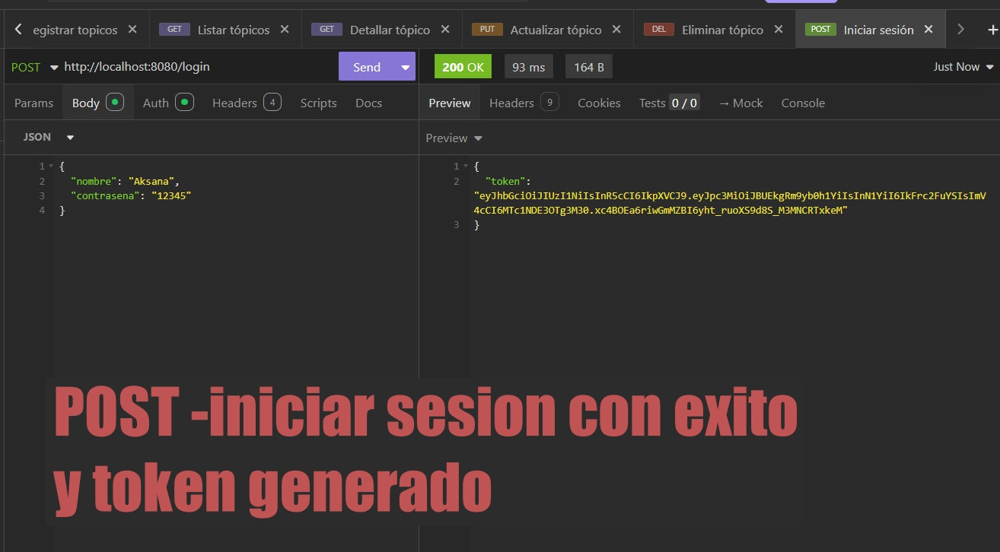
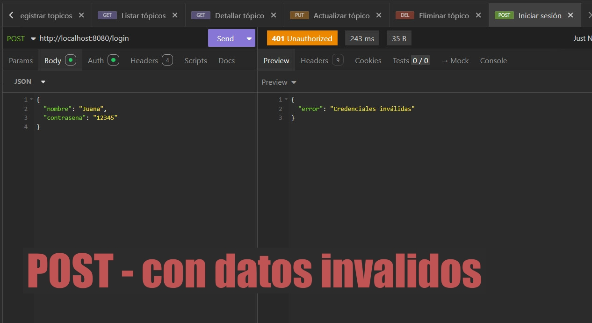
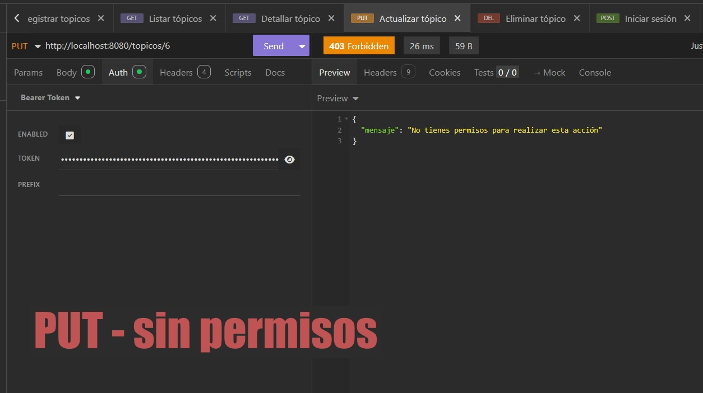
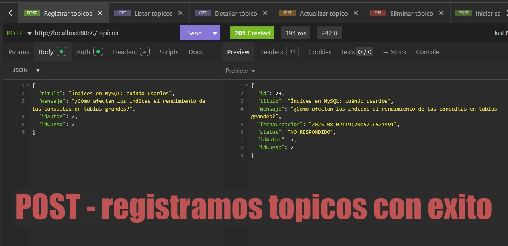
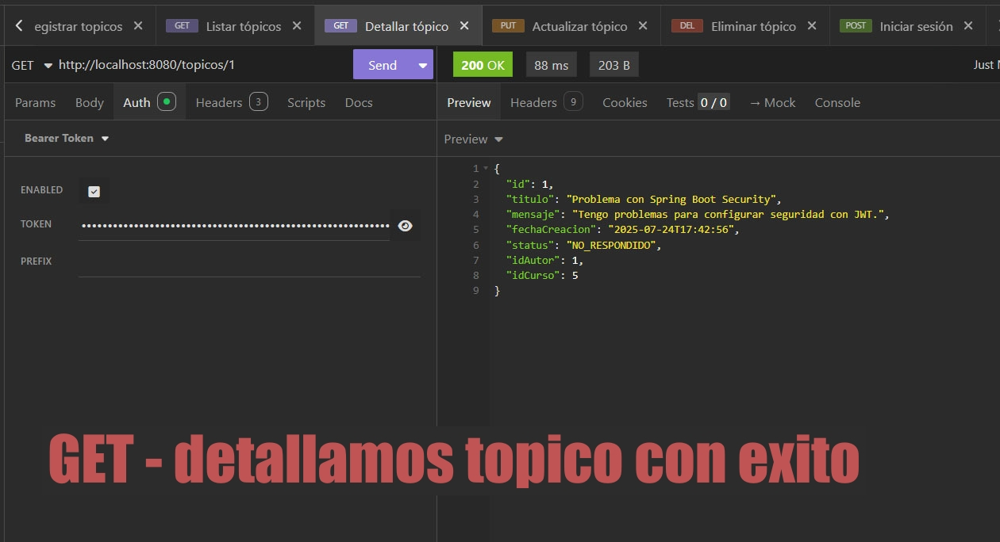
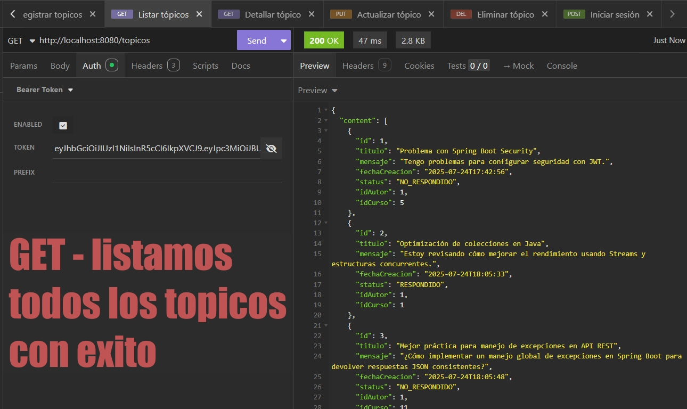
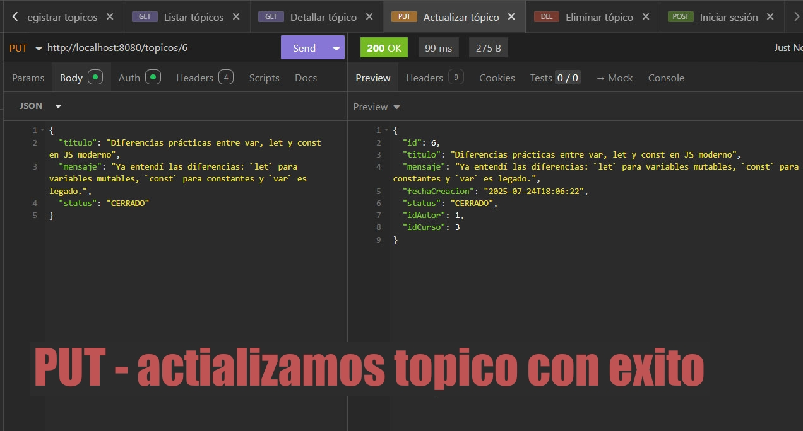
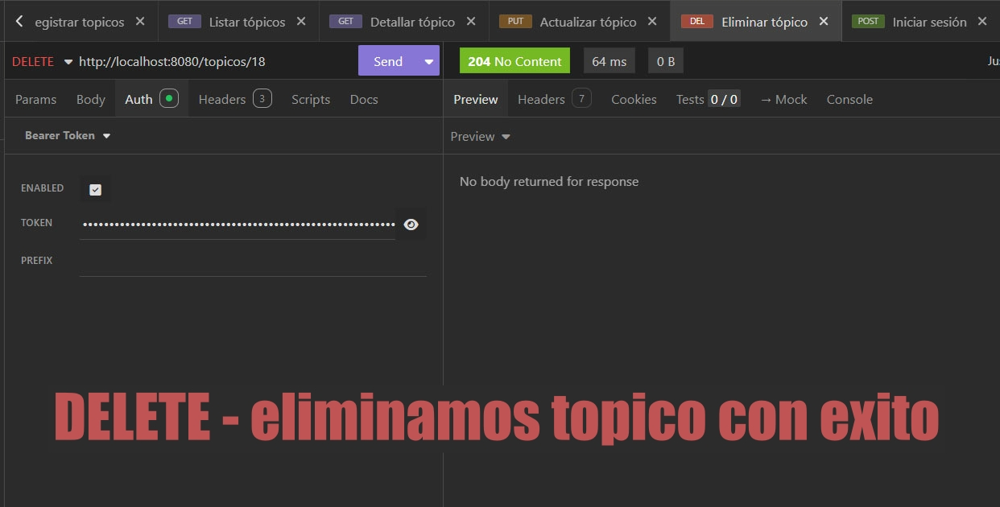

# FOROHUB API REST
### 🏹 Descripción
**FOROHUB** es una API REST construida con **Spring Boot** 3 para gestionar foros de discusión. <br>
Permite a los usuarios crear, leer, actualizar y eliminar _tópicos_ (preguntas/discusiones). <br>
La aplicación implementa **autenticación y autorización** con JWT y control de acceso basado en roles para garantizar que solo los usuarios autorizados puedan realizar ciertas acciones.

# Tecnologías utilizadas
- **Java 17** - Lenguaje de programación robusto y moderno.
- **Spring Boot** - Framework para facilitar el desarrollo de aplicaciones web y APIs.
- **Spring Security** - Módulo para la seguridad, manejo de autenticación y autorización.
- **JWT (JSON Web Tokens)** - Para autenticación y manejo seguro de sesiones.
- **JPA/Hibernate** - ORM para facilitar la interacción con la base de datos.
- **MySQL** - Base de datos relacional para persistencia de datos.
- **Flyway** – Migraciones automáticas para el control de versiones de la base de datos.

# Funcionalidades principales
**1. Autenticación y autorización**
- Inicio de sesión con credenciales (usuario y contraseña) que genera un **token JWT**.
- Control de acceso por roles: ```ADMIN```, ```USUARIO```, ```MODERADOR```.
⬇
### 📌 Pantalla de login⬇️



**2. Manejo de errores personalizados**
Respuestas claras en caso de:
- Acceso no autorizado (```403 Forbidden```)
- Datos inválidos (```400 Bad Request```)
- Credenciales inválidas (```401 Unauthorized```)

### 📌 Pantalla de credenciales inválidas⬇️


### 📌 Pantalla de acceso no autorizado⬇️



**3. Gestión de tópicos CRUD**
- Crear, consultar, modificar y eliminar tópicos.
- Validación de datos de entrada con **Bean Validation**.
- Protección de endpoints según roles: ```ADMIN```, ```USUARIO``` y ```MODERADOR```.

**4. Persistencia y modelos**
- Uso de **JPA** para definir entidades y relaciones.
- La persistencia se realiza en una base de datos **MySQL**.
- Roles asignados a usuarios para control granular de permisos.
- Migraciones gestionadas con **Flyway** para control de versiones de base de datos.

## Endpoints principales
| Método   | Endpoint           | Descripción                  | Autenticación | Rol requerido      |          
|----------|--------------------|------------------------------|----------------|--------------------|
| `POST`   | `/usuarios`        | Registro de nuevo usuario    | No             |         -          |
| `POST`   | `/login`           | Genera un JWT para sesión    | No             |         -          |
| `POST`   | `/cursos`          | Crea un nuevo curso          | Sí             |       ADMIN        |
| `POST`   | `/topicos`         | Crea un nuevo tópico         | Sí             |      USUARIO       |
| `GET`    | `/topicos`         | Obtiene todos los tópicos    | Sí             |       ADMIN        |           
| `GET`    | `/topicos/{id}`    | Obtiene un tópico específico | Sí             |         -          |
| `PUT`    | `/topicos/{id}`    | Actualiza un tópico por ID   | Sí             | USUARIO, MODERADOR |
| `DELETE` | `/topicos/{id}`    | Elimina un tópico por ID     | Sí             |       ADMIN        |

### 📌 Registramos un nuevo tópico (POST)⬇️



### 📌 Obtenemos un tópico específico (GET)⬇️



### 📌 Obtenemos todos los tópicos (GET)⬇️



### 📌 Actualizamos un tópico (PUT)⬇️



### 📌 Eliminar un tópico (DELETE)⬇️




 # 📂 Estructura del proyecto:
```plaintext
src
├── controller       # Controladores REST/
├── domain           # Entidades del modelo de dominio/
├── infra            # Excepciones, configuración/
├── repository       # Repositorios JPA/
├── security         # Seguridad JWT y configuración de roles/
└── resources/
    └── application.properties  # Configuración
```

# ⚙️ Configuración
**1.** Configura el archivo ```application.properties``` con:
```
spring.datasource.url=jdbc:mysql://localhost:3306/forohub
spring.datasource.username=tu_usuario
spring.datasource.password=tu_contraseña
api.security.token.secret=tu_clave_secreta
```
**2.**  Ejecuta las migraciones con **Flyway** para crear las tablas necesarias en la base de datos MySQL.
